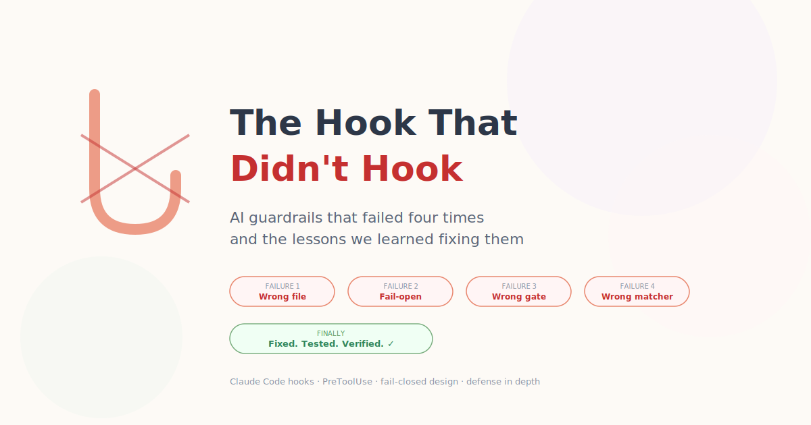
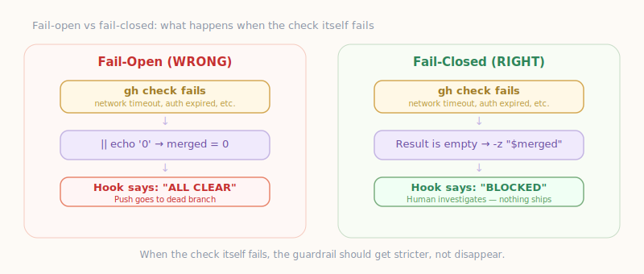
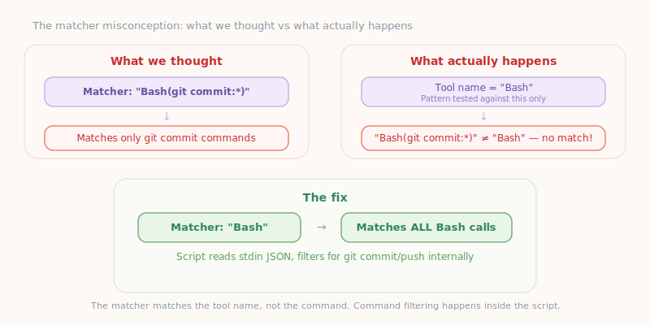
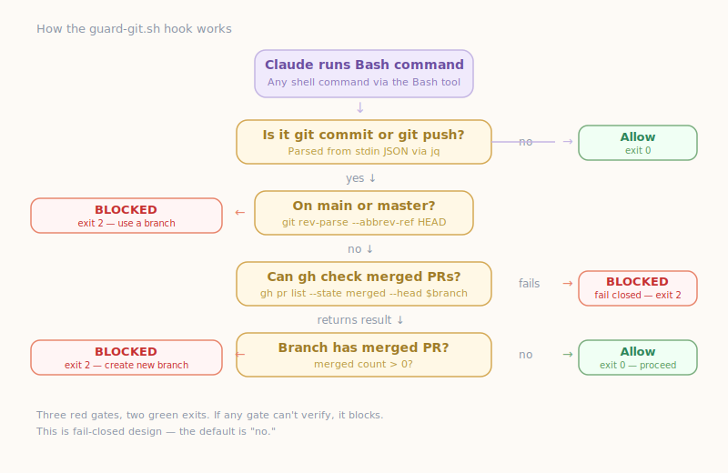

# How I Set Up Claude Code Hooks That Actually Work (After Failing Four Times)



*Claude Code follows your CLAUDE.md instructions most of the time — but "most of the time" isn't good enough when the AI is pushing code to production. Here's how I built hooks that enforce rules deterministically, and the four ways they failed before they worked.*

---

## Why You Need Hooks (Not Just CLAUDE.md)

If you're using Claude Code, you probably have a `CLAUDE.md` file with rules like "never commit to main" or "always run tests before pushing." Claude reads these, understands them, and follows them — roughly 90-95% of the time.

But that other 5-10%? Under context pressure, in a long session, when it's juggling multiple tasks, Claude can rationalize its way past soft guidance. "I'll just push this one small fix directly" or "the tests passed last time, I'll skip them." It's not malicious — it's the same way a human developer might cut a corner at 2am. The instructions are suggestions. The AI treats them as strong suggestions. But suggestions aren't guarantees.

**Hooks are the guarantee.** They're shell scripts that Claude Code executes before (or after) specific tool calls. They run outside the AI's context — Claude can't reason its way around them, negotiate with them, or decide to skip them. If the hook says "blocked," the action doesn't happen. Period.

Think of it this way:

- **CLAUDE.md** = the constitution. Teaches Claude *why* the rules exist. Followed ~95% of the time.
- **Hooks** = the law enforcement. Doesn't care about *why*. Blocks the action 100% of the time.

Every critical rule should exist at both levels: soft guidance in CLAUDE.md (so Claude understands and cooperates) and hard enforcement in hooks (so it can't slip through when it doesn't).

## The Problem

I'm building a bilingual static site with a standard workflow: feature branches, pull requests, human review, merge to main. Claude Code does the implementation; I review and merge. Cloudflare Pages auto-deploys on merge to main.

One rule matters more than any other: **never push to a branch whose PR has already been merged.** If you do, the commits go nowhere — they sit on a dead branch while main moves on. The deployment never sees them. You think you shipped code. You didn't. Your users see nothing.

This happened to me three times in one session before I even realized. Claude would finish work on a branch, I'd merge the PR, and Claude would keep committing and pushing to the same dead branch — completely unaware that the PR was already merged. The commits vanished into the void.

I needed a hook that checks, before every commit and push, whether the current branch already has a merged PR. If it does, block the action and tell Claude to create a new branch.

Simple, right? It took four attempts.

## The Initial Hook

I set up a `PreToolUse` hook in Claude Code's `.claude/settings.json`:

```json
{
  "hooks": {
    "PreToolUse": [
      {
        "matcher": "Bash(git push:*)",
        "hooks": [
          {
            "type": "command",
            "command": "branch=$(git rev-parse --abbrev-ref HEAD); merged=$(gh pr list --state merged --head \"$branch\" --json number --jq 'length' 2>/dev/null || echo '0'); if [ \"$merged\" -gt 0 ]; then echo \"BLOCKED\" >&2; exit 1; fi"
          }
        ]
      }
    ]
  }
}
```

The logic: before every `git push`, check if the current branch has a merged PR on GitHub. If it does, block the push.

Seems bulletproof. It wasn't.

---

## Failure #1: The Hook File Was Never on Main

### What happened

We created `.claude/settings.json` with all the hooks — commit guards, push guards, lint checks, secret scanning. We committed it to a feature branch. That branch got merged via PR.

Then Claude pushed to a branch whose PR had already been merged. No hook fired.

### Why it failed

The hooks file was committed to a feature branch that was merged into main. But when we later created another branch and tried to add more hooks, **that updated file only existed on the new branch, not on main.**

More fundamentally: Claude Code loads hooks from `.claude/settings.json` at session start. If the file doesn't exist on the branch you're working on, the hooks don't fire.

### The attempted fix

We realized the file needed to be on main. We recovered it from the dead branch and included it in the next PR.

> **Lesson: Hooks only work if the hooks file is actually present on the branch you're working on. Commit it early, commit it to main.**

---

## Failure #2: Fail-Open on Error

### What happened

Even with the file in place, the hook didn't block a push to a merged branch.

### Why it failed

Look at this line:

```bash
merged=$(gh pr list --state merged --head "$branch" --json number --jq 'length' 2>/dev/null || echo '0')
```

See the `|| echo '0'`? If the `gh` command fails for **any** reason — network timeout, auth token expired, API rate limit, the `gh` CLI not being installed — the variable defaults to `'0'`, which means "no merged PRs found." The hook says "all clear, push away."

This is a **fail-open** design. The guardrail disappears exactly when things go wrong.



### The fix

We changed it to fail-closed:

```bash
merged=$(gh pr list --state merged --head "$branch" --json number --jq 'length' 2>/dev/null)
if [ -z "$merged" ]; then
  echo "BLOCKED: Could not verify branch status." >&2
  exit 1
fi
```

If `gh` returns nothing (empty string), we block. The human can investigate why `gh` failed, but no code ships to a dead branch in the meantime.

> **Lesson: Security guardrails must fail closed. If you can't verify the condition, assume the worst. `|| echo '0'` is the enemy.**

---

## Failure #3: Only Guarding the Push, Not the Commit

### What happened

The hook was on main, it was fail-closed, and it worked when tested in isolation. Then Claude pushed to a merged PR's branch again. Third time.

### Why it failed

Here's the timeline:

1. Claude creates a branch and opens a PR
2. Human merges the PR
3. Claude (still on the same branch, in the same session) makes more changes
4. Claude runs `git commit` — **no hook checks for merged PRs at commit time**
5. Claude runs `git push` — the hook should fire, but the push goes through

The hook was only on `Bash(git push:*)`. The commit step had no merged-PR check. So Claude happily committed to a dead branch, and by the time the push hook ran, the damage was done.

### The fix

Add the merged-PR check to **both** the commit hook and the push hook. Defense in depth.

> **Lesson: Guard every step in the pipeline, not just the last one. A guardrail at the exit doesn't help if damage happens at the entrance.**

---

## Failure #4: The Matchers Never Matched Anything

### What happened

We added the merged-PR check to both hooks. We verified the settings file was on main. We verified the logic was fail-closed. We launched a fresh subagent to test.

**The commit went through. The push went through. Nothing was blocked.**

### Why it failed

This was the most fundamental failure of all. We investigated the Claude Code documentation and discovered:

**The matcher `Bash(git commit:*)` never matched anything.**

The matcher pattern matches the **tool name** only — not the command content. When Claude runs `git commit -m "message"` via the Bash tool, the hook system sees:

- Tool name: `"Bash"`
- Tool input: `{"command": "git commit -m \"message\""}`

The matcher regex is applied only to `"Bash"`. Our pattern `Bash(git commit:*)` was trying to match a tool literally named `Bash(git commit:*)`, which doesn't exist.



**Every hook we wrote across all three previous attempts was invisible.** The logic was correct, the file was in the right place, the fail-closed design was sound — but the matcher never fired. We were guarding a door that nobody walks through.

### The real fix

Complete rewrite:

1. **Matcher:** `"Bash"` — matches ALL Bash tool calls
2. **Filtering:** done inside a shell script by reading the command from stdin JSON
3. **Exit code:** `2` — the Claude Code convention for blocking (not `1`)



The hook script (`.claude/hooks/guard-git.sh`):

```bash
#!/bin/bash
INPUT=$(cat)
COMMAND=$(echo "$INPUT" | jq -r '.tool_input.command // empty' 2>/dev/null)
[ -z "$COMMAND" ] && exit 0

IS_COMMIT=false; IS_PUSH=false
echo "$COMMAND" | grep -qE 'git\s+commit' && IS_COMMIT=true
echo "$COMMAND" | grep -qE 'git\s+push' && IS_PUSH=true
if ! $IS_COMMIT && ! $IS_PUSH; then exit 0; fi

BRANCH=$(git rev-parse --abbrev-ref HEAD 2>/dev/null)
if [ "$BRANCH" = "main" ] || [ "$BRANCH" = "master" ]; then
  echo "BLOCKED: Do not commit/push directly to $BRANCH." >&2; exit 2
fi

MERGED=$(gh pr list --state merged --head "$BRANCH" --json number --jq 'length' 2>/dev/null)
if [ -z "$MERGED" ]; then
  echo "BLOCKED: Cannot verify branch status." >&2; exit 2
fi
if [ "$MERGED" -gt 0 ]; then
  echo "BLOCKED: Branch '$BRANCH' has a merged PR. Create a new branch." >&2; exit 2
fi
exit 0
```

The settings.json:

```json
{
  "hooks": {
    "PreToolUse": [
      {
        "matcher": "Bash",
        "hooks": [
          {
            "type": "command",
            "command": "bash .claude/hooks/guard-git.sh"
          }
        ]
      }
    ]
  }
}
```

> **Lesson: Read the documentation. We spent four iterations fixing logic, fail-safety, and coverage — all of which were correct — while the most basic thing (the matcher syntax) was wrong from the start. A perfectly engineered guardrail attached to nothing guards nothing.**

---

## The Test That Finally Passed

After the fourth fix, we launched a fresh Claude Code subagent (clean context, hooks loaded from the corrected settings) and ran a comprehensive test:

| Test | Branch | Action | Expected | Actual | Result |
|------|--------|--------|----------|--------|--------|
| 1 | Verify hook script | `ls -la .claude/hooks/guard-git.sh` | Executable | `-rwxr-xr-x`, 1944 bytes | PASS |
| 2 | Verify matcher | Read settings.json | `"Bash"` | `"Bash"` | PASS |
| 3 | Commit on merged branch | `git commit` on branch with merged PR | **BLOCKED** | **BLOCKED** — "Branch has a merged PR." | **PASS** |
| 4 | Push on merged branch | `git push` on same branch | **BLOCKED** | **BLOCKED** — "Branch has a merged PR." | **PASS** |
| 5 | Commit on fresh branch | `git commit` on new branch (no PR) | **ALLOWED** | **ALLOWED** — commit created | **PASS** |

All five tests passed. Both the blocking path and the happy path work correctly.

---

## The Four Principles

### 1. Read the Documentation First

We spent four iterations (across several hours) debugging logic, fail-safety, and hook coverage. The real problem — wrong matcher syntax — would have been caught in 5 minutes by reading the docs. Everything we built on top of the wrong matcher was wasted work, no matter how correct the logic was.

### 2. Fail Closed, Never Open

If your check can't determine whether it's safe to proceed, the answer is "no."

```bash
# WRONG: fail-open
result=$(some_check 2>/dev/null || echo 'safe')

# RIGHT: fail-closed
result=$(some_check 2>/dev/null)
if [ -z "$result" ]; then
  echo "Cannot verify safety. Blocking." >&2
  exit 2
fi
```

### 3. Guard Every Gate, Not Just the Last One

If your pipeline has steps A → B → C, put the check at A, B, and C. We guarded the push but not the commit. The AI committed to a dead branch multiple times before the push hook ever had a chance to fire. Redundancy is not waste — it's resilience.

### 4. Test the Actual Mechanism, Not Just the Logic

We tested whether `gh pr list` correctly detects merged PRs (it does). We tested whether the shell logic correctly blocks on a positive result (it does). But we never tested whether **the hook actually fires when Claude runs `git commit`** — until the fourth iteration.

This is the difference between unit testing and integration testing. Unit tests said "the logic works." An integration test would have said "the hook never fires."

---

## The Complete Setup (Copy-Paste Ready)

### File: `.claude/hooks/guard-git.sh`

```bash
#!/bin/bash
INPUT=$(cat)
COMMAND=$(echo "$INPUT" | jq -r '.tool_input.command // empty' 2>/dev/null)
[ -z "$COMMAND" ] && exit 0

IS_COMMIT=false; IS_PUSH=false
echo "$COMMAND" | grep -qE 'git\s+commit' && IS_COMMIT=true
echo "$COMMAND" | grep -qE 'git\s+push' && IS_PUSH=true
if ! $IS_COMMIT && ! $IS_PUSH; then exit 0; fi

BRANCH=$(git rev-parse --abbrev-ref HEAD 2>/dev/null)
if [ "$BRANCH" = "main" ] || [ "$BRANCH" = "master" ]; then
  echo "BLOCKED: Do not commit/push directly to $BRANCH." >&2; exit 2
fi

MERGED=$(gh pr list --state merged --head "$BRANCH" --json number --jq 'length' 2>/dev/null)
if [ -z "$MERGED" ]; then
  echo "BLOCKED: Cannot verify branch status." >&2; exit 2
fi
if [ "$MERGED" -gt 0 ]; then
  echo "BLOCKED: Branch '$BRANCH' has a merged PR. Create a new branch." >&2; exit 2
fi
exit 0
```

### File: `.claude/settings.json`

```json
{
  "hooks": {
    "PreToolUse": [
      {
        "matcher": "Bash",
        "hooks": [
          {
            "type": "command",
            "command": "bash .claude/hooks/guard-git.sh"
          }
        ]
      }
    ]
  }
}
```

### Requirements

- `gh` CLI installed and authenticated (`gh auth login`)
- `jq` installed (`brew install jq` or `apt install jq`)
- Hook script must be executable (`chmod +x .claude/hooks/guard-git.sh`)

### Where to put it

- **`.claude/settings.json`** in the repo — project-specific, committed to version control
- **`~/.claude/settings.json`** — global, applies to every project on the machine

Use both. Belt and suspenders.

---

## One More Thing

These hooks are specific to Claude Code (Anthropic's AI coding CLI), but the principles apply to any automated agent or CI system that can modify code:

- GitHub Actions workflows that auto-commit
- Dependabot or Renovate bots
- AI coding assistants (Copilot, Cursor, Claude Code, etc.)
- Any script that runs `git commit` and `git push` programmatically

Anywhere a non-human actor can push code, you need guardrails that:
1. Actually fire (test the mechanism, not just the logic)
2. Fail closed (block when unsure)
3. Guard every gate (not just the last step)
4. Exist before the work begins (on main, in global config)

The AI won't check whether the PR was merged. It'll just keep working. That's not a bug in the AI — it's a bug in the guardrails.

---

*This post documents real failures from a real development session on March 23, 2026. The hooks failed four times in approximately 6 hours of work. Each failure was caught by a human reviewing the deployment pipeline. The final configuration was verified by an automated test suite running in a fresh subagent context.*
